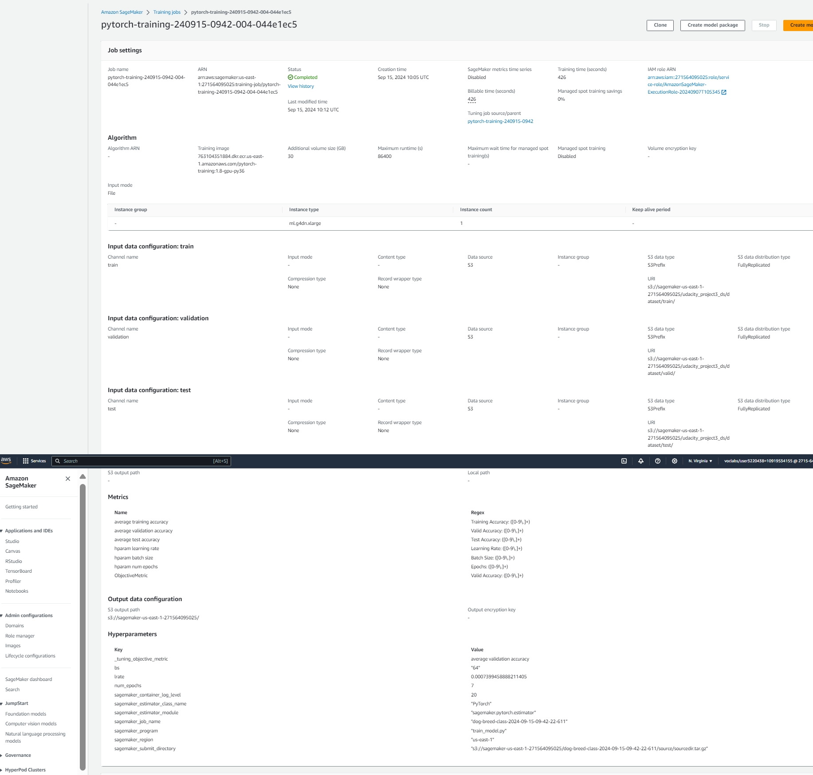
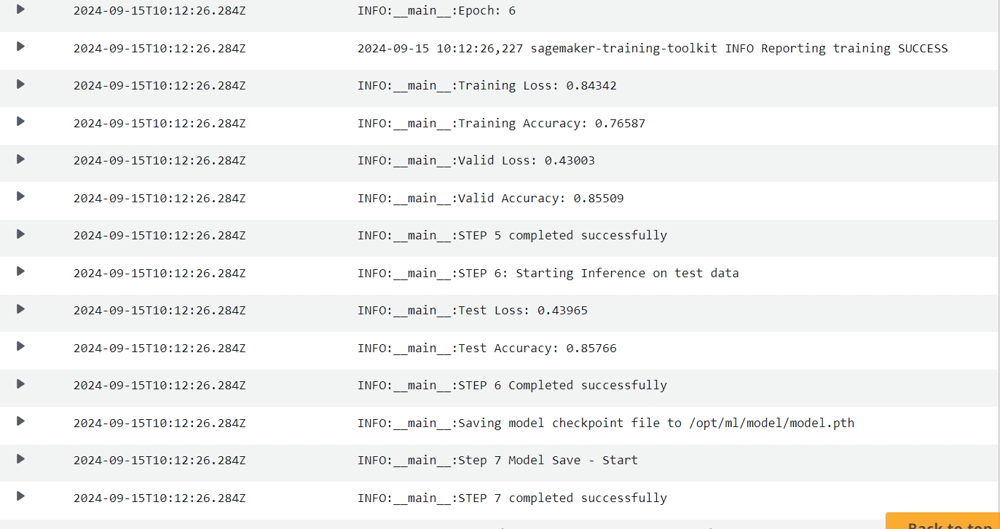
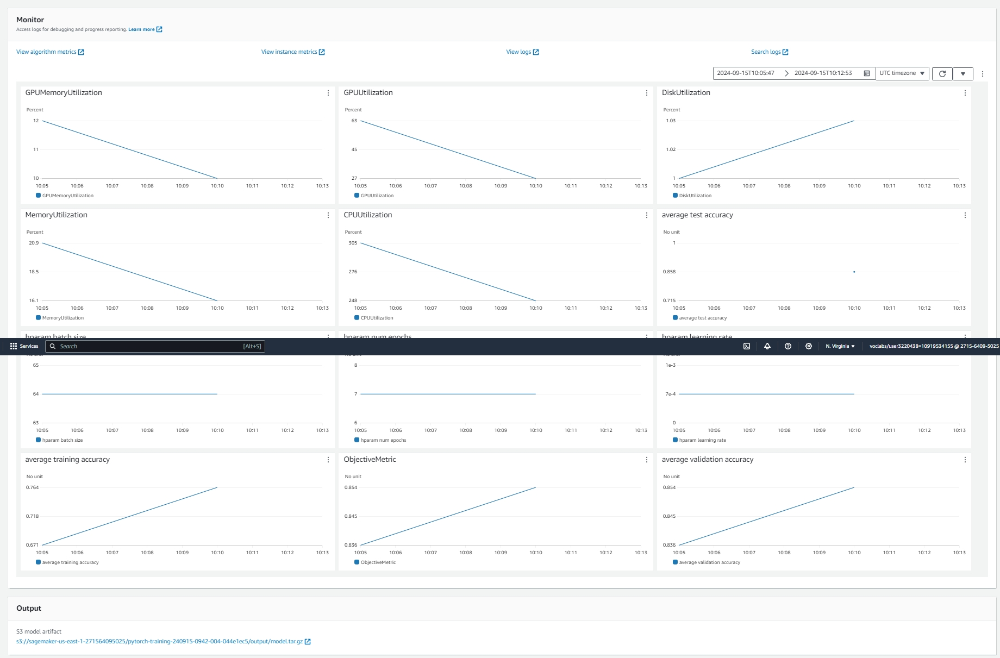
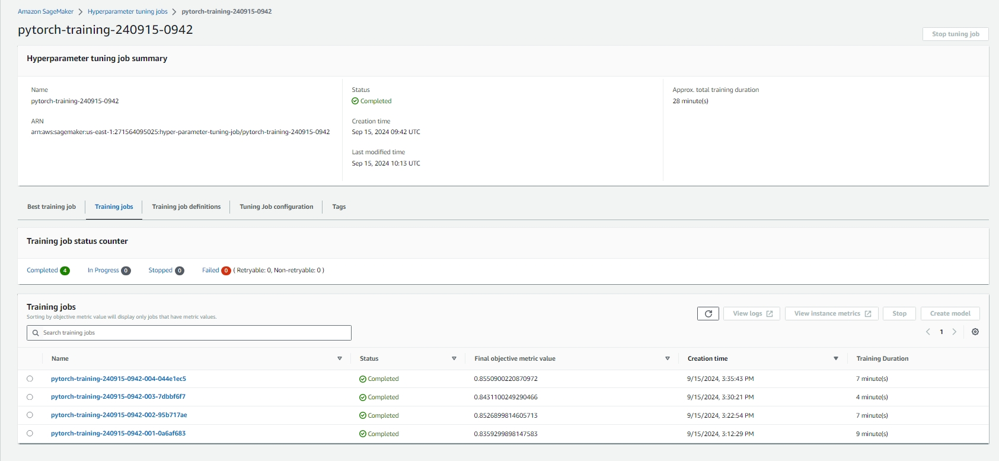
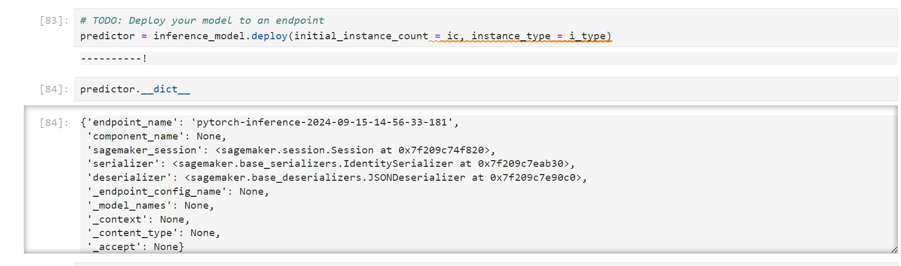

# Image Classification using AWS SageMaker

This project involves classification of pictures of dogs into one of the 133 dog breed classes on which model is trained. First we choose a SOTA model like resnet50 which is already pretrained on imagenet. We fine tune this model first by performing hyperparameter tuning to find the best set of hyperparameters and then using best hyperparameters we train the model again with sagemaker debugger and profiler(this is to identify any bottlenecks/problems that are system resources related or the ones related to actual model training and parameters). We then deploy the fine tuned model to sagemaker endpoint and perform inference by selecting random images from test dataset.

## Project Set Up and Installation

There are no special installation steps. Just upload the jupyter notebook and scripts as per directory hirierchy to sagemaker studio and execute commands in notebook. There are commands that are commented out as those are one time commands (like downloading/copying to S3 location etc) and these will need to be run first time the project is run. Of course this project is required to be run in sagemaker environment.

There are 3 main files:
1) train_and_deploy.ipynb which is the main jupyter notebook containing code for entire project
2) src/train_model.py --> contains code for model training with debugger/hyperparameter tuning. This script utilizes a hook_true parameter which indicates whether or not to initialize the debugger and set flags during train/validation process.During hyperparameter tuning it is set to False. During training with best hyperparam it is set to True. Rest is taken care of by using hyperparamters passed into the script by estimator/tuner jobs.
3) src/inference.py --> contains the code to perform model inference when the endpoint is invoked.

## Dataset

We are using Dog Breed Dataset which contains images from 133 different dog breeds.

### Overview

We are using Dog Breed Dataset which contains images from 133 different dog breeds . Dataset is further divided into train/validation/test datasets. There are total 8351 images in train/validation/test datasets combined  (train: 6680, validation: 835, test: 836). We downloaded the dataset from url : https://s3-us-west-1.amazonaws.com/udacity-aind/dog-project/dogImages.zip which is in zip format. This needs to be extracted. Post extraction, it is self organized into 3 directories : /train /valid /test containing dog images belonging to different dog breeds

### Access

We downloaded the data using wget command into sagemaker studio jupyter lab instance. 
Downloaded data is in zip format. So next we extract the data(unzip)
Next we copy the data from notebook environment to s3 using AWS cli command "!aws s3 cp --recursive --quiet <source> <s3 destination>
Next we verify that data has been correctly copied into s3 location

## Hyperparameter Tuning
**TODO**: What kind of model did you choose for this experiment and why? Give an overview of the types of parameters and their ranges used for the hyperparameter search

I chose resnet50 as this a highly performing SOTA image classification model utilizing CNN architecture and residual connections to ensure robust training of the model. We have quite a big dataset (approx 1GB), so model has to be deep and smart enough the learn the patterns present in the dataset in an efficient manner. resnet50 checks all these boxes.

I tuned the model on following hyperparameter types and ranges:

bs(batch size): batch size indicates how many data samples are presented to model in single operation. This setting needs to be set according to the GPU memory. IF we set the batch size too high (let us say 256 on GPU with 16 GB RAM), GPU may not be able to handle it and most likely result cuda running out of memory errors. On the other hand if we set it too low, then there are chances that model may end up memorizing the data rather than finding patterns that can generalized across dataset and unseen similar images resulting in overfitting. Again it depends on the dataset size and available GPU memory and we need to find optimal batch size through hyper parameter tuning. Under normal training scenario, this indicates how often forward and backpropagation(unless you are doing gradient accumulation) are done and that again impacts how well the model learns about patterns  present in the training data.

lrate(Learning Rate): Learning rate determines how fast the model parameters are changes during backpropagation process. Gradient calculation during backprop determines the direction in which parameter should change. Learning Rate determines how big the change is in the chosen direction. It is like descending the mountain. You decide to go down to the valley. How fast you reach the valley will depend on two factor 1) how steep the slope is through which you are traversing(this is gradient calculation during backprop) 2) How big the steps are (this is the learning rate). Setting learning rate too small will cause model to learn slowly and setting it too high will cause to overshoot the minima resulting in oscillation. So a balance between two is required. Also it depends on how transfer learning is being carried out.If you are training the entire model, then it is preferred to keep learning rate small enough to let the model learn new information without forgetting the information it has already learnt during pretraining. If you are keeping everything frozen except the classifier block then we can use higher learning rates along with rate schedulers like OCLR(One cycle learningr rate).

num_epochs: This determines how many times the entire training dataset is run through the model. 7 epochs will mean that I am going to pass all the data present in training dataset through model  seven times.

hp_range = {
    "bs": CategoricalParameter([16,32,64]),
    "lrate": ContinuousParameter(0.0002, 0.001),
    "num_epochs": IntegerParameter(3, 7)
}

Best hyperparameter values are :
{'bs': 64, 'lrate': 0.0007399458888211405, 'num_epochs': 7}

Remember that your README should:
- Include a screenshot of completed training jobs
- Logs metrics during the training process
- Tune at least two hyperparameters
- Retrieve the best best hyperparameters from all your training jobs

## Debugging and Profiling
**TODO**: Give an overview of how you performed model debugging and profiling in Sagemaker
Debugger component refers to monitoring/identigying issue relates to model training (like model overfitting, poor weight initialization etc)
Profiler component refers to profiling/monitoring system/hardware resources and bottlenecks if any like GPU utilization etc.
First we set the rules configurations corresponding to components we want to monitor and then provide necessary inputs into estimator object. Also, in the training script we need to initialize the debugger configuration and set the hooks appropriately at the start of every training/test/validation loop.

### Results
**TODO**: What are the results/insights did you get by profiling/debugging your model?
1) Training and validation losses indicated normal downward trend and do not indicate overfitting. This is further demonstrated through accuracy statistics collected during model training.
2) GPUMemoryIncrease triggered 62 times which indicates we should use machines with larger GPU RAM. Alternatively we can train with lower batch size like 32
3) LowGPUUtilization triggered 3 times which is well within threshold and does not indicates anything to be worried about
4) Dataloader rule trigerred 1 times which can be safely ignored and seems to be one-off case.

**TODO** Remember to provide the profiler html/pdf file in your submission.
It is provided as part of submission

## Model Deployment
**TODO**: Give an overview of the deployed model and instructions on how to query the endpoint with a sample input.
Once the model was trained with optimal hyperparameters, we noted down model artifacts location in s3. Then we set up serializers and deserializers. This is required because the data need to be submitted to endpoint through http call which requires data to be serialized. Once the model performs classification, the result needs to be deserialized to be presented effectively. So this is a required step. Then we create a PyTorch Model object utilizing the model artifict location, script used to perform inference and other framework parameters. Next we deployed the model object and created endpoint using model.deploy and specifying the number and type of machine instances to be used.
Next we create a predictor object using endpoint object. We then encapsulate the image data using predictor.predict method and send it to endpoint. Model listening on endpoint will perform inference and send the result back. We then process the result and determine if the image is correctly classified or not.

Code Sample for querying endpoint: 
response = predictor.predict(payload, initial_args={"ContentType": "image/jpeg"})

**TODO** Remember to provide a screenshot of the deployed active endpoint in Sagemaker.
.

## Standout Suggestions
**TODO (Optional):** This is where you can provide information about any standout suggestions that you have attempted.
